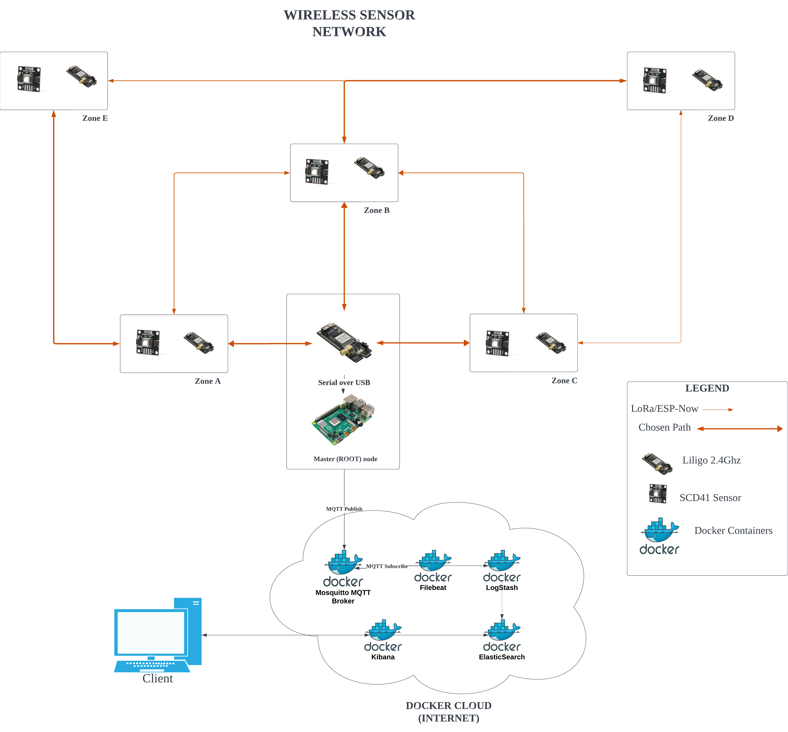

# Singapore Environmental Monitoring Project

## T24 Group Members
1. Benjamin Loh Choon How 2201590
2. Low Hong Sheng Jovian 2203654
3. Poon Xiang Yuan 2200559
4. Wang Ronqi Richie 2201942
5. Woon Jun Wei 2200624

## Introduction

Singapore, a frontrunner in sustainable urban development, grapples with a crucial data gap: the lack of a dedicated Wireless Sensor Network (WSN) to monitor harmful gas (CO2) emissions and their intricate link to temperature fluctuations across diverse urban environments. This absence of comprehensive data impedes our ability to accurately track progress towards ambitious environmental targets and formulate informed policies for critical issues like CO2 reduction and urban heat island mitigation.

## Problem Statement

The lack of comprehensive environmental monitoring poses a significant challenge within Singapore. Currently, there is a dearth of real-time data on CO2 levels and temperature, hindering informed decision-making and sustainable practices in the country. This data gap inhibits the establishment of correlations between environmental factors and their impact on campus well-being and sustainability. Consequently, there is a critical need to develop and deploy a scalable and energy-efficient mesh network utilizing efficient communication protocols to address this challenge.

## Objectives

By providing real-time environmental data, this project aims to enable:

- Identification of correlations between CO2 levels, temperature, and campus environmental conditions.
- Evaluation of the performance and suitability of LoRa and ESP-Now protocols in comparison to traditional mesh algorithms, addressing concerns regarding data latency, reliability, network scalability, and reach.
- Provision of actionable insights to policymakers and stakeholders, facilitating evidence-based strategies for enhancing environmental sustainability within NYP Campus and contributing to broader sustainability initiatives in Singapore.

Through the resolution of this pressing problem, the project endeavors to pave the way for data-driven decision-making and sustainable management practices within NYP Campus, aligning with Singapore’s commitment to environmental stewardship.

## Architectural Overview

The system architecture is designed for efficient data collection and analysis within a Wireless Sensor Network (WSN) mesh. 

It consists of two main components: the WSN mesh and the Data Collection Sink.  The WSN mesh includes sensor nodes with Liligo T3S3 LoRa 2.4Ghz modules, enabling communication via ESP-Now and LoRa protocols for optimal data transmission.  

The Data Collection Sink is the core of the architecture, with the Root Node acting as the master node within the WSN mesh. It connects to the MQTT broker using a Raspberry Pi 4b, facilitating data transmission from the mesh to the processing stages. 

The MQTT Broker, implemented with Mosquitto software in a Docker container, ensures seamless data flow between the WSN mesh and processing units. Data processing and analysis are handled by the ELK Stack, which includes Filebeat, Logstash, and Elasticsearch, all deployed in Docker containers. Filebeat collects data from the MQTT broker, Logstash processes and transforms the data, and Elasticsearch stores the processed data for visualization and analysis through Kibana.  

The architecture leverages ESP-Now and LoRa protocols for efficient WSN mesh communication, the MQTT broker for data flow management, the ELK Stack for data processing and analysis, and Docker containers for software component isolation and management

## Getting Started

### Prerequisites

#### Hardware Requirements
- LilyGO TTGO T-Beam V1.1 ESP32 LoRa Module: This hardware module is used as nodes that communicate in the Wireless Sensor Network using the ESP-NOW protocol as default and failover to LoRa in case of failure.
- Raspberry Pi 4 Model B: This hardware module is used as the sink node that collects data from the nodes and sends it to the backend.
- Sensirion SCD4x CO2 Sensor Module: This hardware module is used to measure the CO2 levels and other environment data in the environment.

#### Software Requirements
- Arduino IDE: This is the primary software used for writing and uploading the code to the Arduino board.
- ESP-NOW Library: This library is used for communication between ESP32 devices.
- LoRa Library (RadioLib): This library is used for communication using LoRa modules.
- SensirionI2CScd4x Library: This library is used for interfacing with the Sensirion SCD4x CO2 sensor module.
- SPI Library: This library is used for communication with devices using the Serial Peripheral Interface (SPI).
- Wire Library: This library is used for communication with devices using the I2C protocol.

#### Installation Procedures
- Install the Arduino IDE from the official website.
- Install the ESP-NOW library from the Arduino Library Manager.
- Install the RadioLib library from the Arduino Library Manager.
- Install the SensirionI2CScd4x library from the Arduino Library Manager.
- Install the SPI library from the Arduino Library Manager.
- Install the Wire library from the Arduino Library Manager.
- Install the ESP32 board package from the Arduino Board Manager.
- Download the code from the repository and shift these folders to the Arduino libraries folder.
  - `ESPNowCommunication`
  - `LoraCommunication`
  - `MACaddr`
  - `Protocol_Manager`

[//]: # (### Installation)

[//]: # ()
[//]: # (1. Steps to install the project.)

[//]: # (2. Configuration guidelines.)

## Usage

### Peer Nodes Deployment
- Connect the LilyGO TTGO T-Beam V1.1 ESP32 LoRa Module to the computer using a USB cable.
- Open the Arduino IDE and upload `Main.ino` from the `Main` folder to the LilyGO TTGO T-Beam V1.1 ESP32 LoRa Module.

### Master Node Infrastructure

A detailed guide on how to run the ELK Backend and MQTT Broker is detailed in [Master Node Infrastructure Readme](./elastic-stack-docker/README.md).

# Analysis

## Network Traffic Analysis

A concise analysis of the network traffic generated by the ESP-NOW and LoRa protocols is detailed in [Network Traffic Analysis](./elastic-stack-docker/Analysis.md).

## Dashboard Statistics

### ESP-NOW Node Power Consumption

### ESP-NOW Master Node Power Consumption

### LORA Node Power Consumption

### LORA Master Node Power Consumption

