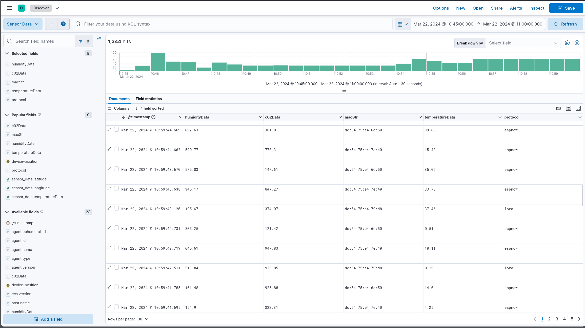
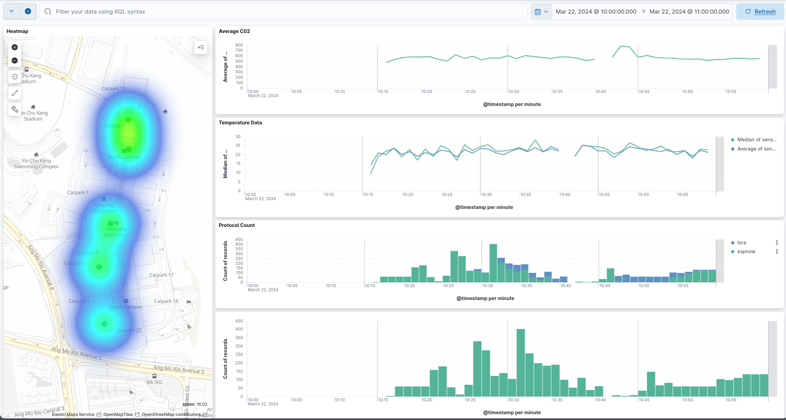
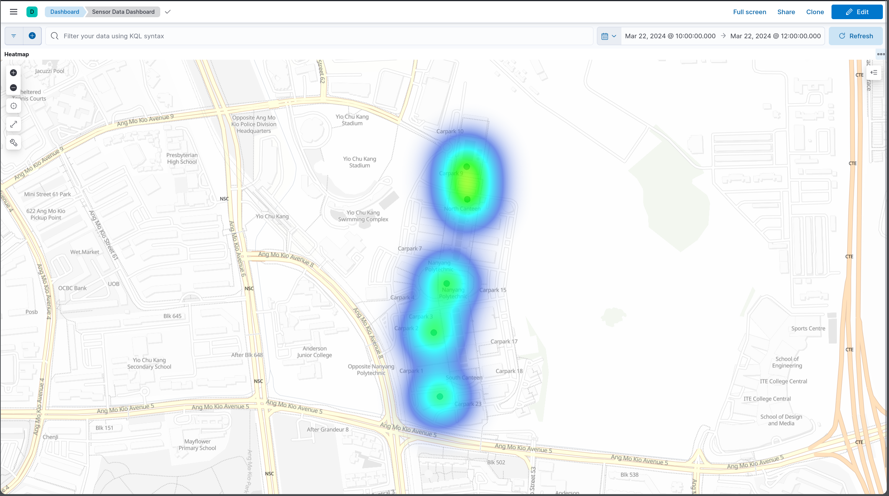
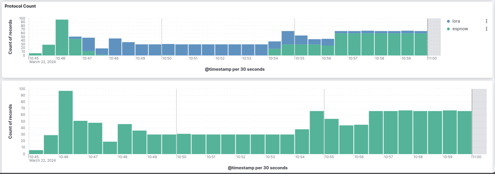
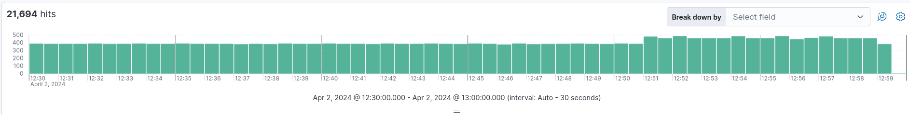
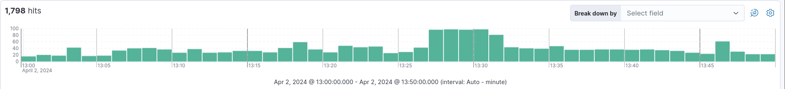

# Analysis

> Woon Jun Wei (2200624)

The Kibana dashboard enables the user to visualize and analyze the data collected by the ELK stack. The dashboard is accessible at `http://localhost:5601`. The default user and password are `elastic` and `changeme` respectively.

The dashboard displays the raw data received from the MQTT broker. The user can view the data in a tabular format and filter the data based on the fields. The user can also search for specific data using the search bar.

This image shows the Kibana dashboard with the logs from the MQTT broker. The dashboard is divided into several sections:
1. Heatmap: This section shows the number of sensor data packets received over time (and location).
2. Average C0_2: This section shows the average CO2 level over time.
3. Temperature: This section shows the temperature over time (Average and Median).
4. Protocol Count: This section shows the number of packets received for each protocol.
5. Count of Records: This section shows the total number of records received over time.

The heatmap represents the number of sensor data packets received over time (and location). The heatmap is color-coded to represent the number of packets received. The user can zoom in and out to view the data at different levels of granularity.

The protocol count section shows the number of packets received for each protocol. The user can view the data in a tabular format or as a bar chart. The data can be filtered based on the protocol type.
One notable feature is the visualisation of the switching function, transitioning from Lora (Blue) to ESP-Now (Green), depicted in the top bar chart.
Another notable insight would be the decrease in the number of packets received for the Lora protocol, and the increase in the number of packets received for the ESP-Now protocol.

## Analysis

The image above shows the number of packets received for the ESP-Now protocol over time. The graph shows an average number of `384` packets received for the ESP-Now protocol. The graph also shows a slight increase in the number of packets received for the ESP-Now protocol over time.

The image above shows the number of packets received for the Lora protocol over time. The graph shows a decreasing trend in the number of packets received for the Lora protocol. This could be due to various reasons such as signal interference, packet loss, or changes in the environment.

## Conclusion

The ELK stack provides a powerful platform for visualizing and analyzing data collected from various sources. The Kibana dashboard enables the user to create custom visualizations and dashboards to gain insights into the data. The ELK stack can be used for monitoring, troubleshooting, and analyzing data in real-time. The ELK stack is highly scalable and can handle large volumes of data efficiently. The ELK stack is a valuable tool for organizations looking to gain insights from their data and make informed decisions based on the data analysis.
